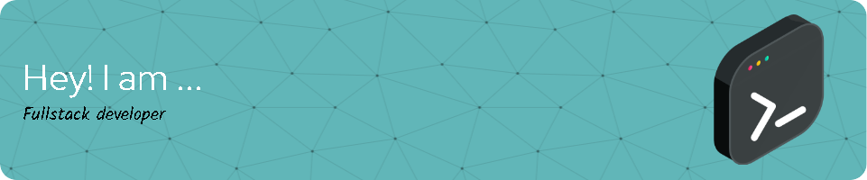

## Quibo 👋

- Estudiante de Ciencias de la computación 💻
- Interés en el Machine Learning y Ciencia de Datos.

## Sobre mí:

- 🌱 Estoy aprendiendo técnicas de análisis y visualización de datos.
- 🔭 Estoy implementando modelos matemáticos de Machine Learning en python.
- 🤔 Desarrollar nuevos proyectos con animo de aprender nuevos modelos.
- ⚡ *Estoy.*
- 📫 Contacto: aguevarao@unal.edu.co

## Algunas herramientas de programación:

<!--
**andres12go/andres12go** is a ✨ _special_ ✨ repository because its `README.md` (this file) appears on your GitHub profile.

Here are some ideas to get you started:

- 🔭 I’m currently working on ...
- 🌱 I’m currently learning ...
- 👯 I’m looking to collaborate on ...
- 🤔 I’m looking for help with ...
- 💬 Ask me about ...
- 📫 How to reach me: ...
- 😄 Pronouns: ...
- ⚡ Fun fact: ...
-->
